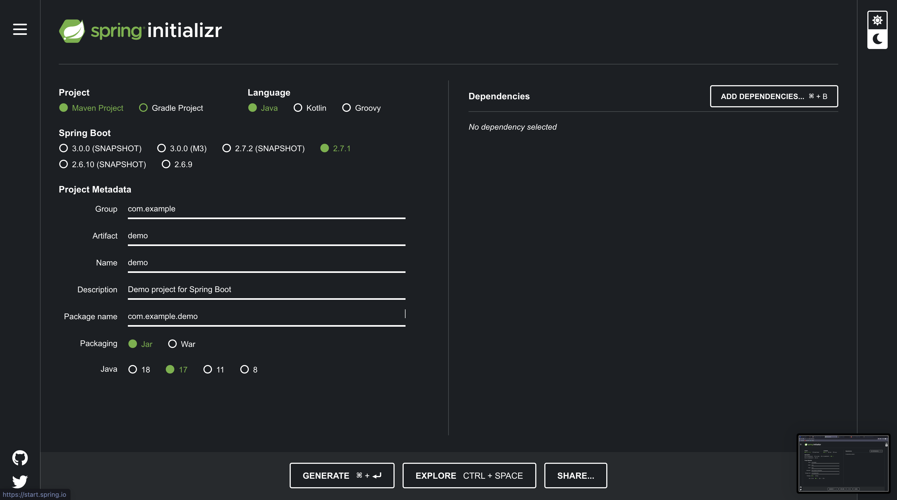
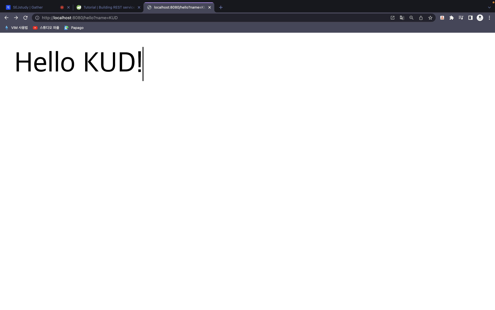

# Anyway start Spring Boot

## 환경 설정

- `spring-boot`를 시작하기 위해서는 먼저 `java`를 설치할 필요가 있습니다.

- 또한 `javascript` 기반의 `Express`나, `python`기반의 `Django`와는 다르게 사이트에서 `intializer`를 제공한다는 점이 있습니다. [링크](https://start.spring.ioa)

  

- 맨 위에 있는 `maven`, `gradle`은 `java`의 빌드관리 도구ㄷ입니다.

- Maven

  - `Maven`은 Java용 프로젝트 관리도구로 Apache의 `Ant` 대안으로 만들어졌습니다.

  - 빌드 중인 프로젝트, 빌드 순서, 다양한 외부 라이브러리 종속성 관계를 `pom.xml`파일에 명시합니다.

  - `Maven`은 외부저장소에서 필요한 라이브러리와 플러그인들을 다운로드 한다음, 로컬시스템의 캐시에 모두 저장합니다.

- Gradle

  - `Maven`과 `Ant`에서 볼수 있는 개념들을 사용하는 대안으로써 나온 프로젝트 빌드 관리 툴이다. (완전한 오픈소스)

  - `Groovy` 언어를 사용한 `Domain-specific-language`를 사용한다. (xml파일을 보다 간결)

  - 꽤 큰규모로 예상되는 `multi-project` 빌드를 도울 수 있도록 디자인되었다.

  - `Gradle`은 프로젝트의 어느부분이 업데이트되었는지 알기 때문에, 빌드에 점진적으로 추가할 수 있다.

- `java`의 버전 선택에 있어서 `17`버전이 기본값으로 되어있어 버전의 수정이 필요했습니다.

  - `SDKman`이라는 `java version tool`이 존재해 통해 버전을 17버전으로 만들었습니다.

## Hello World

- 기본적이 프로젝트 구조는 아래와 같습니다.

- 프로젝트의 폴더 구조를 보면 `main/java/com/`와 같은 디렉토리가 반복 되는걸 볼수 있습니다.

- `Android`를 해본 사람들이라면 어느정도 감이 오지만, 저런 구조는 앞서 말한 빌드 툴인 `maven`,`gradle`로 인해 생긴것입니다.

```bash
TodoServer
├── HELP.md //md 파일
├── build.gradle // ㅎgradle 설정파일
├── gradle
│   └── wrapper
│       ├── gradle-wrapper.jar
│       └── gradle-wrapper.properties
├── gradlew
├── gradlew.bat
├── settings.gradle
└── src
    ├── main
    │   ├── java
    │   │   └── com
    │   │       └── example
    │   │           └── TodoServer
    │   │               └── TodoServerApplication.java
    │   └── resources
    │       ├── application.properties
    │       ├── static
    │       └── templates
    └── test
        └── java
            └── com
                └── example
                    └── TodoServer
                        └── TodoServerApplicationTests.java

```

- `./gradlew bootRun`을 동작시키면 `build.gradle`를 읽고 필요한 `dependency`를 설치하게 됩니다.

- `localhost:8080/hell?name=KUD`라고 들어가면 `name`에서 정한 내용을 읽고 화면에 띄우는걸 볼수있습니다.



- `Hello World`를 출력하는 코드는 아래와 같습니다. 

```java
   @SpringBootApplication 
   // RestController 을통해 TodoServerApplication의 인스턴스를 반환하여 GET 요청을 처리
   // 또한 모든 메서드가 view 대신 도메인 객체를 반환하는 컨트롤러라고 표현
   @RestController 
   public class TodoServerApplication {
      private static final String template = "Hello, %s!";
      private  final AtomicLong counter = new AtomicLong();

      public static void main(String[] args) {
         SpringApplication.run(TodoServerApplication.class, args);
      }

      // GetMapping은 HTTP GET의 요청을 담당하는 부분
      // @RequestMapping(method=GET)을 사용하여 처리 가능
      @GetMapping("/hello")
      public Greeting greeting(@RequestParam(value = "name", defaultValue = "World") String name) {
      // 여기에서 반환하는 값은 모두 jackson2를 통해  JSON 변환  
         return new Greeting(counter.incrementAndGet(),String.format(template,name));
      }

   }
```

## REST API
