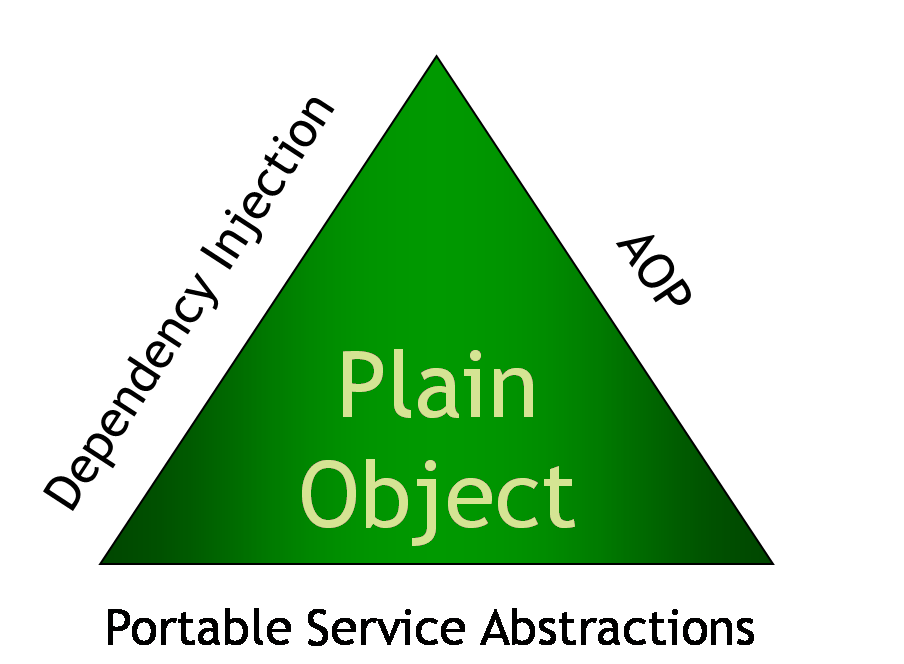

# Spring DI?

## Spring 삼각형


### DI란

 - IOC라고 부르기도 하며, 어떤 객체가 사용하는 의존 객체를 직접 만들어 사용하는게 아니라, 주입받아 사용하는것이다.

 - SoccerPlayer.java
 ```java
   class SoccerPlayer {
     private NikeSoccerBall nikeBall;

     public SoccerPlayer() {
       this.nikeBall = new NikeSoccerBall();
     }

     public void playSoccer() {
       System.out.println("축구선수가 공을 찼다!");
       this.nikeBall.touchBall();
     }
   }
 

 ```

 - AdidasSoccerBall.java, NikeSoccerBall.java
 ```java
   class AdidasSoccerBall {
     public void touchBall() {
       System.out.println("아디다스 축구공이 굴러간다!");
     }
   }

   class NikeSoccerBall {
     public void touchBall() {
       System.out.println("나이키 축구공이 굴러간다!");
     }
   }
 ```

 - Driver.jav
 ```java
   public class Driver {
     public static void main(String[] args) {
       SoccerPlayer sp = new SoccerPlayer();
       sp.playSoccer();
     }
   }
 ```

 - 위 코드를 보면 `SoccerPlayer`는 `NikeSoccerBall`에 읜존성을 가지고 있다.

 - 따라서 축구선수사 다른 공으로 바꾸게 된다면 `SoccerPlayer`역시 수정을 해야하는 문제가 발생하고 이것을 결합도가 높다고 말할수있다.

 - 이런 역전 관계를 이제 역전 시켜보도록 하자

- SoccerBall
```java

interface SoccerBall {
  void touchBall();
}

class AdidasSoccerBall implements SoccerBall {
  public void touchBall() {
    System.out.println("아디다스 축구공이 굴러간다!");
  }
}

class NikeSoccerBall implements SoccerBall {
  public void touchBall() {
    System.out.println("나이키 축구공이 굴러간다!");
  }
}

```

- SoccerPlayer

```java

class SoccerPlayer {
  private SoccerBall ball;

  public void setSoccerBall(SoccerBall ball) {
    this.ball = ball;
  }

  public void playSoccer() {
    System.out.println("축구선수가 공을 찼다!");
    this.ball.touchBall();
  }
}
```

- Driver

```java

public class Driver {
  public static void main(String[] args) {
    SoccerPlayer sp = new SoccerPlayer();

    // NikeSoccerBall
    SoccerBall nikeBall = new NikeSoccerBall();
    sp.setSoccerBall(nikeBall);
    sp.playSoccer();

    // AdidasSoccerBall
    SoccerBall adidasBall = new AdidasSoccerBall();
    sp.setSoccerBall(adidasBall);
    sp.playSoccer();
  }
}
```
 - SoccerBall을 인터페이스로 만들었고 SoccerBall을 implements하는 각각의 축구공 클래스를 만들었다. 

 - 축구선수는 축구공을 자신이 만들어서 사용하는 것이 아니라. 

 - 외부에서 만들어 진 것을 받아서 사용하고 있다. 

 - 또한 타입을 인터페이스로 바꾸었기에 어떤 공이든 코드에 변경없이 사용할 수 있다.

### IOC 컨테이너

 - 위 예제에서 `SoccerBall`의 종류를 선택하고 `SoccerPlayer`에게 `Set`해주어야 한다.  

 - 이러한 문제를 `Spring`에서는 `IOC`컨테이너를 통해 해결한다.

- SoccerBall
```java

   interface SoccerBall {
     String touchBall();
   }

   @Component("adidasBall") // adidasBall이란 이름을 가진 Bean으로 등록
   public class AdidasSoccerBall implements SoccerBall {
     public String touchBall() {
         return "아디다스 축구공이 굴러간다!";
     }
   }

   @Component("nikeBall") // nikeBall이란 이름을 가진 Bean으로 등록
   public class NikeSoccerBall implements SoccerBall {
     public String touchBall() {
         return "나이키 축구공이 굴러간다!";
     }
   }

```

- SoccerPlayer
```java
   @Component // 의존성을 주입받는 객체도 Bean으로 등록되어야 한다.
   public class SoccerPlayer {
       @Autowired
       @Qualifier("nikeBall")
       private SoccerBall ball;

       public String playSoccer() {
           return "축구선수가 공을 찼다! \n" + this.ball.touchBall();
       }
   }

```

- SoccerController
```java
   @RestController
   public class SoccerController {
       @Autowired // SoccerPlayer라는 타입을 가진 Bean을 찾아서 주입시킴
       private SoccerPlayer soccerPlayer;

       @RequestMapping("/soccer")
       public String soccerDriver() {
           return soccerPlayer.playSoccer();
       }
   }
```

- 해당 코드를 보면 알수 있겠지만, `new`를 통해 `SoccerPlayer`를 선언하지 않고 사용하고 있다.

- `@Component`라는 오너테이션이 붙은 객체는 `spring`객체에서 `Spring Bean`으로 등록하고 생성한다.  

- 그렇다면 `Spring Bean`을 관리하는 `Container`라는 개념은 무엇일까?

### 컨테이너

   - 우리는 객체를 사용하기 위해서 new 생성자를 이용하거나 getter/setter 기능을 써야만 했다.

   - 한 어플리케이션에는 이러한 객체가 무수히 많이 존재하고 서로 참조하고 있을 것이다.

   - 그 정도가 심할 수록 의존성이 높다고 표현한다.

   - 낮은 결합도와 높은 캡슐화로 대변되는 OOP에서 높은 의존성은 매우 지양된다.

   - 컨테이너의 종류는 `BeanFactory`, `ApplicationContext` 이 존재한다.

   - BeanFactory : 

      - Bean 객체를 생성하고 관리하는 인터페이스이다.

      - Be-nFactory 컨테이너는 구동될 때 Bean 객체를 생성하는 것이 아니라. 

      - 클라이언트의 요청이 있을 때(getBean()) 객체를 생성한다.

   - ApplicationContext :

      - BeanFactory를 상속받은 interface이다.
      
      - 부가적인 기능이 많기 때문에 더 많이 사용한다.

      - ApplicationContext 컨테이너는 구동되는 시점에 등록된 Bean 객체들을 스캔하여 객체화한다.

### Bean Life-Cycle

   - 1. Spring Application이 시작되고 Bean 설정파일 초기화

   ```java
      public BeanA() {} // 기본생성자

   //config.java(어노테이션이 붙은 모든 것을 찾음) 혹은 web.xml을 이용하여 Bean으로 등록할 대상을 찾아 기본 생성자를 호출하여 Bean 등록
   ```

   - 2. Bean으로 등록할 객체 초기화
   ```java
      // @Component를 사용할 경우
      @PostConstruct
      public void init() {
        System.out.println("init");
      }
      // @Bean을 사용할 경우
      @Bean(initMethod = "init")
    public BeanA beanA() {
        return new BeanA();
      }
      Bean의 의존관계를 확인하여(@Autowired, @Resource) 다른 Bean을 주입해주고, Bean 설정파일에 있는 init-method를 호출한다.
   
   ```


   - 3. Bean 준비상태
   
      - 모든 Bean의 초기화가 끝나고 사용 가능한 상태


   - 4. Bean 소멸상태

   ```java
      // @Component를 사용할 경우
      @PreDestroy
      public void destroy() {
        System.out.println("destroy");
      }

      // @Bean을 사용할 경우
      @Bean(destroyMethod = "destroy")
      public BeanA beanA() {
        return new BeanA();
      }
      // spring 프로젝트가 종료될 때 Bean 설정파일의 destroy-method가 호출된다. (초기화 순서의 역순으로 실행)
   ```

### Bean Scope

   - Bean을 정의하는것은 Bean객체를 생성하는 하는 방식을 정의하는것이다.

   - Class와 마찬가지로 하나의 Bean 정의에 해당하는 다수의 객체가 생성이 가능

   - Bean 정의를 통해 객체 다양한 종속성 및 설정값을 주입할수 있을 뿐만 아니라, 객체의 범위를 정의할 수있다.

   #### Spring Bean Scope

   | Scope | 설명 |
   |---- | --------------- |
   | SingleTon   | 하나의 Bean 정의에 대하여 Spring Ioc Container 내에 단 하나의 객체만 존재   |
   | ProtoType   | 하나의 Bean 정의에 대하여 다수의 객체가 존재 할 수있다.   |
   | Request   | 하나의 Bean 정의에 대하여 하나의 HTTP Request의 생명 주기 안에 단한의 객체만 존재 즉, 각각의 HTTP Request는 자신만의 객체를 가진다. web-aware String ApplicationContext 안에서만 유효하다. |
   | Session   |  하나의 Bean 정의에 대하여 하나의 HTTP Session 의 생명 주기 안에 단한의 객체만 존재 web-aware String ApplicationContext 안에서만 유효하다.  |
   | global Session   |  하나의 Bean 정의에 대하여 하나의 HTTP Session의 생명 주기 안에 단한의 객체 일반 적으로 portlet Context안에서 유효하다. web-aware String ApplicationContext 안에서만 유효하다.  |
   

