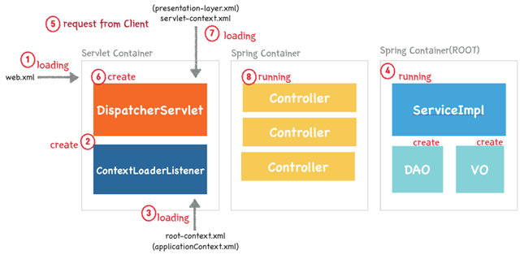

# DispathcerServlet

   - Spring MVC는 `Front Controller (DispathcerServlet)` 를 두고 있다.

   > DispathcerServlet는 web.xml에 정의한 서블릿

    

## 동작원리

   - 1. 웹어플리케이션이 실행되면 `Tomcat(WAS)`에 의해 `web.xml`이 로딩이된다.

   - 2. web.xml이 등록되어 있는 `ContextLoaderListener`가 생성되며, `ApplicationContext를 생성한다.

   - 3. 생성된 `ContextLoaderListener`는 `Root-context.xml`을 로딩한다.

   - 4. `Root-context.xml` 에 등록된 `Spring Container`가 구동된다. 이 때 개발자가 작성한 비즈니스 로직에 대한 부분과 `DAO, `VO`` 객체들이 생성된다.

   > DAO (Data Access Object)는 데이터베이스에 접근하기 위한 객체로 삽입,삭제,조회등 조작할수 있는 기능을 수행
   > 
   > DTO (Data Transfer Object)는 데이터 교환을 위한 자바 빈즈를 의미한다. (로직을 가지지 않는 데이터 객체)
   >
   > VO (Value Object)는 값 오브젝트로써 값을 위해  사용되며 Read-Only의 특징을 가짐

   - 5. 클라이언트로부터 Web Application 요청이 들어온다.

   - 6. 첫 요청이 들어오면 `DispatcherServlet(Servlet)`이 생성
      
      - `DispatcherServlet`은 `FrontController`의 역할을 수행하며 전송받은 요청 메시지를 분석하여 알맞은 `PageController`에게 전달하고 응답을 어떻게 할지 결정한다.
      -  `servlet-content.xml` 이 로딩되며, 각 Controller 등이 매핑된다.

   - 7. 실질적인 작업은 PageController에서 일어나므로 이 클래스들을 HandlerMapping / ViewResolver 클래스라 한다. 이 작업은 ThreadPool 을 통해 할당된 유저 Thread 에서 처리된다.

   - 8. 요청은 매핑된 각 Controller로 전달되고 Request를 ModelAndView 형태의 Object 형식으로 DispatcherServlet 으로 전달한다.

   - 9. DispatcherServlet 은 응답 결과값을 각 Model 오브젝트와 View page 를 통해 출력한다. 작업을 처리한 유저 Thread 를 다시 Thread Pool 에 반환한다.

   - 10.  다음 요청부터는 이전에 생성한 DAO, VO, Impl 클래스들과 협업한다.
