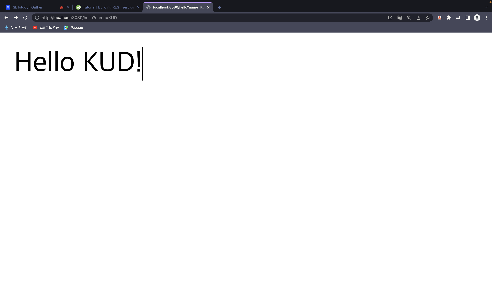

# RESTAPI

## Hello World

- 기본적이 프로젝트 구조는 아래와 같습니다.

- 프로젝트의 폴더 구조를 보면 `main/java/com/`와 같은 디렉토리가 반복 되는걸 볼수 있습니다.

- `Android`를 해본 사람들이라면 어느정도 감이 오지만, 저런 구조는 앞서 말한 빌드 툴인 `maven`,`gradle`로 인해 생긴것입니다.

```bash
TodoServer
├── HELP.md //md 파일
├── build.gradle // ㅎgradle 설정파일
├── gradle
│   └── wrapper
│       ├── gradle-wrapper.jar
│       └── gradle-wrapper.properties
├── gradlew
├── gradlew.bat
├── settings.gradle
└── src
    ├── main
    │   ├── java
    │   │   └── com
    │   │       └── example
    │   │           └── TodoServer
    │   │               └── TodoServerApplication.java
    │   └── resources
    │       ├── application.properties
    │       ├── static
    │       └── templates
    └── test
        └── java
            └── com
                └── example
                    └── TodoServer
                        └── TodoServerApplicationTests.java

```

- `./gradlew bootRun`을 동작시키면 `build.gradle`를 읽고 필요한 `dependency`를 설치하게 됩니다.

- `localhost:8080/hell?name=KUD`라고 들어가면 `name`에서 정한 내용을 읽고 화면에 띄우는걸 볼수있습니다.



- `Hello World`를 출력하는 코드는 아래와 같습니다. 

```java
   @SpringBootApplication 
   // RestController 을통해 TodoServerApplication의 인스턴스를 반환하여 GET 요청을 처리
   // 또한 모든 메서드가 view 대신 도메인 객체를 반환하는 컨트롤러라고 표현
   @RestController 
   public class TodoServerApplication {
      private static final String template = "Hello, %s!";
      private  final AtomicLong counter = new AtomicLong();

      public static void main(String[] args) {
         SpringApplication.run(TodoServerApplication.class, args);
      }

      // GetMapping은 HTTP GET의 요청을 담당하는 부분
      // @RequestMapping(method=GET)을 사용하여 처리 가능
      @GetMapping("/hello")
      public Greeting greeting(@RequestParam(value = "name", defaultValue = "World") String name) {
      // 여기에서 반환하는 값은 모두 jackson2를 통해  JSON 변환  
         return new Greeting(counter.incrementAndGet(),String.format(template,name));
      }

   }
```
  
## REST API
- 위에서는 `REST`통신을 통해 브라우저에 `Hello World`라는 결과물을 나타내보았습니다.

- 이번에는 서버에서 데이터를 받아서  로그로 보여주는걸 해볼 생각입니다.

```json
{
   "type": "success",
   "value": {
      "id": 10,
      "quote": "Really loving Spring Boot, makes stand alone Spring apps easy."
   }
}
```

- 일단 정보를 받아올 객체를 `class` 형식으로 정의하고, `value`의 객체 역시 정의 해주어야합니다.

- 데이터 받는 객체
```java
  package com.example.consumingrest;
  
  import com.fasterxml.jackson.annotation.JsonIgnoreProperties;
  
  @JsonIgnoreProperties(ignoreUnknown = true)
  public class Quote {
  
    private String type;
    private Value value;
  
    public Quote() {
    }
  
    public String getType() {
      return type;
    }
  
    public void setType(String type) {
      this.type = type;
    }
  
    public Value getValue() {
      return value;
    }
  
    public void setValue(Value value) {
      this.value = value;
    }
  
    @Override
    public String toString() {
      return "Quote{" +
          "type='" + type + '\'' +
          ", value=" + value +
          '}';
    }
  }
```

- value 객체
```java
    package com.example.consumingrest;
    
    import com.fasterxml.jackson.annotation.JsonIgnoreProperties;
    
    @JsonIgnoreProperties(ignoreUnknown = true)
    public class Value {
    
    private Long id;
    private String quote;
    
    public Value() {
    }
    
    public Long getId() {
    return this.id;
    }
    
    public String getQuote() {
    return this.quote;
    }
    
    public void setId(Long id) {
    this.id = id;
    }
    
    public void setQuote(String quote) {
    this.quote = quote;
    }
    
    @Override
    public String toString() {
    return "Value{" +
    "id=" + id +
    ", quote='" + quote + '\'' +
    '}';
    }
    }
```

- 이제 데이터 통신에서 필요한 객체들을 만들어 보았으니, 통신을할 코드를 짜보도록하겠습니다.

```java
public class REST {
//    Log기능을 사용하기 위해 slef4j의 Logger를 가지고 왔습니다.
  private static final Logger log = LoggerFactory.getLogger(REST.class);

  public static void main(String[] args) {
    SpringApplication.run(REST.class, args);
  }

  @Bean
//  jackson 라이브러리를통해 직렬화 개시
  public RestTemplate restTemplate(RestTemplateBuilder builder) {
    return builder.build();
  }

  @Bean
  public CommandLineRunner run(RestTemplate restTemplate) throws Exception {
    return args -> {
      ConsumRest quote =
              restTemplate.getForObject("https://quoters.apps.pcfone.io/api/random", ConsumRest.class);
      log.info(quote.toString());
    };
  }

}
```
